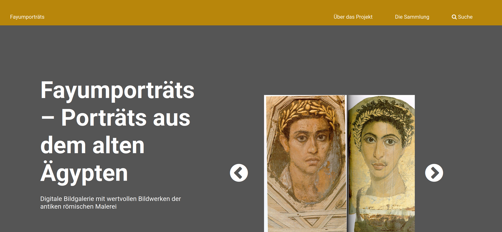
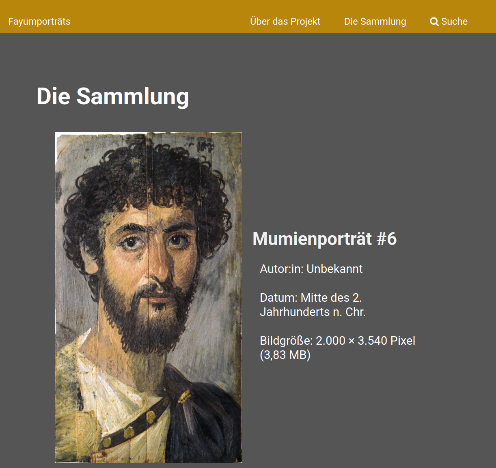
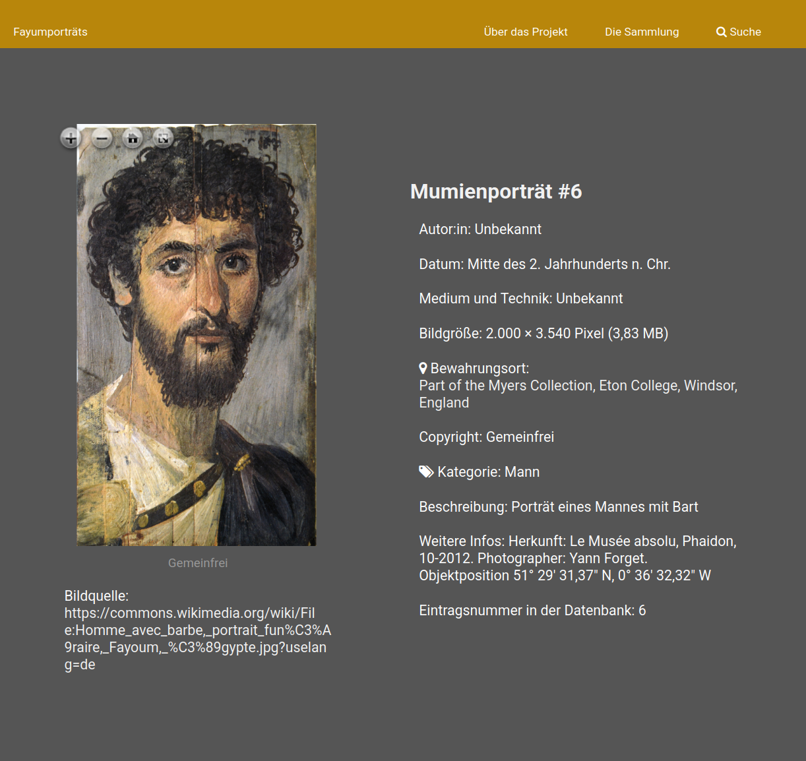
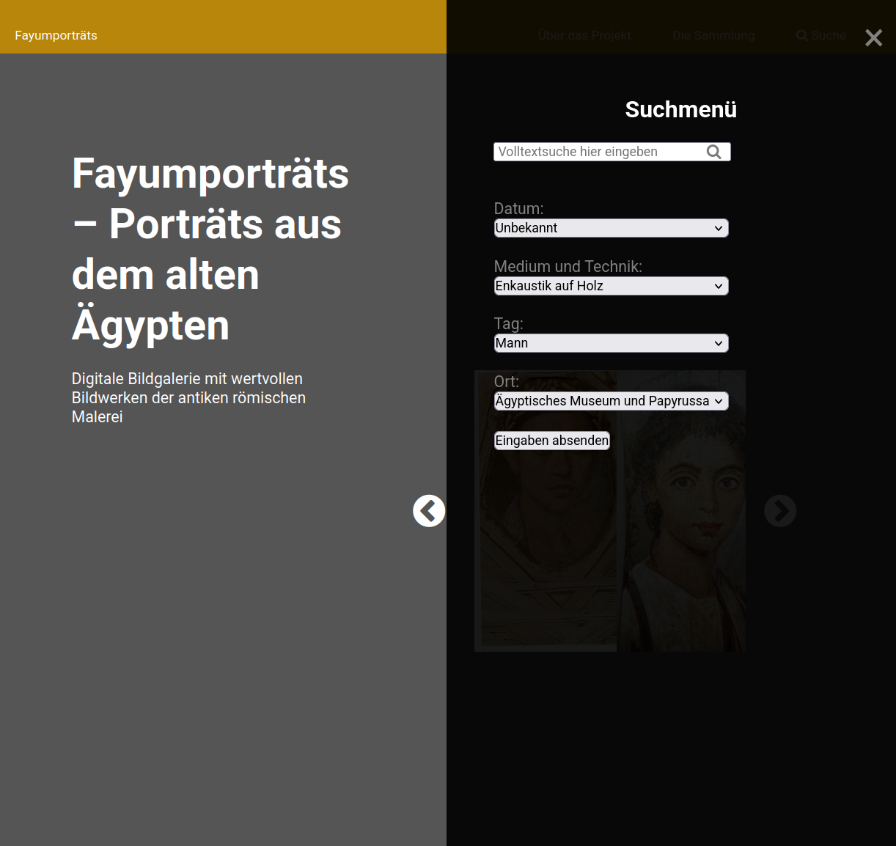

# Geisteswissenschaftliche Datenbanken im Web: Digitale Bildgalerie von Fayumporträts

Digitaler Bildkatalog zu einer kleinen Sammlung der sogenannten *Fayumporträts*[^1], die ein interessantes und wertvolles Zeugnis der antiken römischen Malerei darstellen. Über die entwickelte Webanwendung haben Nutzer:innen Zugang zu Bildern und Informationen über die Porträts, die beide die dem gesamten Webprojekt zugrunde liegenden Daten darstellen. Außerdem stehen die grafische Gestaltung und das responsive Design des digitalen Bildkatalogs im Vordergrund.

<p float="left" style="text-align: center;">
    <figure style="display: inline-block; margin: 10;">
        
        <figcaption>1. Startseite der Webanwendung</figcaption>
    </figure>
</p>
<p float="left" style="text-align: center;">
    <figure style="display: inline-block; margin: 10;">
        
        <figcaption>2. Bilderkatalog-Seite mit <i>Mumienporträt #6</i> im Vordergrund</figcaption>
    </figure>
</p>
<p float="left" style="text-align: center;">
    <figure float="left" style="display: inline-block; margin: 10;">
        
        <figcaption>3. Seite mit detaillierten Informationen über das <i>Mumienporträt #6</i></figcaption>
    </figure>
</p>
<p float="left" style="text-align: center;">
    <figure float="left" style="display: inline-block; margin: 10;">
        
        <figcaption>4. Suchfenster (rechte Hälfte der Seite) für gefilterte und Volltextsuche</figcaption>
    </figure>
</p>


## Webprojekt-Implementierung

Der digitale Bildkatalog wurde auf Backend- und Frontend-Niveau, mit Schwerpunkt auf serverseitiger Konfiguration und Datenbankverbindung, entwickelt. Ein lokaler Server wurde konfiguriert, um die Webanwendung auszuführen. Daher stellt PHP die Verbindung zu der Datenbank her, um Daten effizient zu speichern und abzurufen. Im Frontend definiert HTML die Seitenstruktur, während JavaScript den dynamischen Inhalt verwaltet. CSS gewährleistet das ansprechende Design und sorgt für responsive Benutzerfreundlichkeit auf verschiedenen Geräten.

## Installation und Ausführung der Webanwendung

Um die Webanwendung lokal erfolgreich auszuführen, wurde das [XAMPP-Paket](https://www.apachefriends.org/de/index.html) unter Linux installiert und verwendet. Insbesondere handelte es sich um *LAMPP* (*Linux Apache MySQL PHP Perl*), also die für Linux-Systeme entwickelte Version von XAMPP, die in der Entwicklungsumgebung eingesetzt wurde.

Es sollte sichergestellt werden, dass sich das Repository der Webanwendung in dem Verzeichnis ```/opt/lampp/htdocs``` befindet, damit es korrekt funktioniert.

Nach der Installation des LAMPP-Pakets öffnen Sie das Terminal und geben Sie den folgenden Befehl ein, um den Server zu starten: ```sudo /opt/lampp/lampp start```.

Starten Sie die Webanwendung im Browser unter der folgenden Adresse: ```http://127.0.0.1/Geisteswissenschaftliche-Datenbanken-im-Web/startseite.php```.

Um den Server zu stoppen, geben Sie im Terminal den Befehl ```sudo /opt/lampp/lampp stop``` ein.

[^1]: Siehe [https://de.wikipedia.org/wiki/Mumienportr%C3%A4t](https://de.wikipedia.org/wiki/Mumienportr%C3%A4t).
